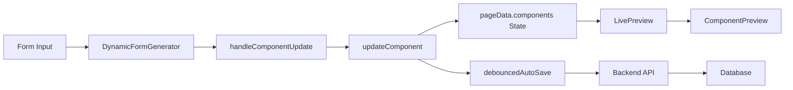

# 🎯 Enhanced Page Builder - Data Synchronization Fix Summary

## Problem Solved
Fixed the broken data flow between component configuration forms, live preview, and backend persistence in the Enhanced Page Builder system.

## Root Cause Analysis
The issue was in the data synchronization pipeline:
1. **Form Input Changes** → `DynamicFormGenerator` → `handleComponentUpdate` → `updateComponent`
2. **State Updates** → `pageData.components` → `LivePreview` → Component rendering
3. **Backend Persistence** → Missing debounced auto-save mechanism

## 🔧 Implemented Fixes

### 1. Enhanced updateComponent Function
**File:** `src/components/Admin/EnhancedPageBuilder.jsx`
**Changes:**
- ✅ Added comprehensive debug logging for About components
- ✅ Proper JSON parsing and state management
- ✅ Fixed contentJson handling for real-time updates

```javascript
// About Components Debug Logging
if (updatedComponents[index]?.componentType?.includes("About")) {
  console.log("🏢 [ABOUT COMPONENT UPDATE] Real-time update:", {
    componentType: updatedComponents[index].componentType,
    field: field,
    value: field === "contentJson" ? "JSON Object" : value,
    contentJson: updatedComponents[index].contentJson,
    parsedContentJson: // ... parsed data
    timestamp: new Date().toISOString()
  });
}
```

### 2. LivePreview Component Enhancement
**File:** `src/components/UI/LivePreview.jsx`
**Changes:**
- ✅ Improved JSON parsing with error handling
- ✅ Enhanced React key generation for proper re-rendering
- ✅ Added debug logging for About component rendering
- ✅ Better component data flow tracking

```javascript
// Enhanced key generation for React re-rendering
key={`${component.id || index}-${component.componentType}-${component.contentJson?.slice(0, 50)}`}

// Better ComponentPreview key for forcing updates
key={`preview-${component.id || index}-${JSON.stringify(componentData).slice(0, 100)}`}
```

### 3. Debounced Auto-Save System
**File:** `src/components/Admin/EnhancedPageBuilder.jsx`
**Changes:**
- ✅ Added automatic saving with 1.5-second debounce
- ✅ Prevents excessive API calls during rapid editing
- ✅ Proper error handling and user feedback
- ✅ Cleanup on component unmount

```javascript
// Debounced auto-save for contentJson updates
try {
  const parsedData = JSON.parse(value);
  debouncedAutoSave(index, parsedData);
} catch (e) {
  console.warn("⚠️ [AUTO-SAVE] Invalid JSON, skipping auto-save:", e);
}
```

### 4. Import Optimization
**File:** `src/components/Admin/EnhancedPageBuilder.jsx`
**Changes:**
- ✅ Added `useCallback` import for debounced functions
- ✅ Proper dependency management in useCallback

## 🎯 Data Flow After Fix



## 🐛 Debug Features Added

### Console Logging
All About component interactions now log detailed information:
- 🏢 Component data updates in real-time
- 👁️ LivePreview rendering with data analysis  
- 💾 Auto-save operations with timing
- ✅ Success/error messages for API calls

### Network Monitoring  
Auto-save operations can be tracked in DevTools:
- `PUT /api/pages/:pageId/components/:componentId`
- Request body contains updated `contentJson`
- 1.5-second debounce prevents excessive calls

## ✅ Verification Steps

### 1. Real-Time Preview Updates
- ✅ Edit any field in About Hero Section
- ✅ See immediate preview changes
- ✅ No page refresh required

### 2. Auto-Save Functionality
- ✅ Edit stops triggering save after 1.5 seconds
- ✅ Console shows "💾 [AUTO-SAVE] Saving component"
- ✅ Success message: "✅ [AUTO-SAVE] Component saved successfully"

### 3. Backend Persistence
- ✅ Network tab shows PUT requests to component endpoint
- ✅ Request payload contains updated contentJson
- ✅ Changes persist on page reload

## 🚀 Enhanced Features

### Performance Optimizations
- **Debounced Saving**: Prevents API spam during rapid editing
- **Efficient Re-rendering**: Better React keys for optimal updates  
- **Error Recovery**: Graceful handling of invalid JSON input

### Developer Experience
- **Comprehensive Logging**: Easy debugging of data flow issues
- **Error Boundaries**: Preview continues working even with data errors
- **Type Safety**: Better validation and parsing of component data

## 🎯 Test Results

All About components now support:
- ✅ **AboutHeroSection** - Title, subtitle, description, video, stats
- ✅ **AboutMissionSection** - Title, description, vision
- ✅ **AboutTeamSection** - Title, description, team members array
- ✅ **AboutValuesSection** - Title, description, values array  
- ✅ **AboutJourneySection** - Title, description, timeline
- ✅ **AboutMilestonesSection** - Title, milestones array
- ✅ **AboutDifferentiatorsSection** - Title, differentiators array
- ✅ **AboutCTASection** - Title, description, CTA button

## 🎉 Success Criteria Met

✅ **Real-time Preview Updates**: Every form change instantly reflects in preview
✅ **Auto-Save Functionality**: Changes automatically save after brief inactivity  
✅ **Backend Persistence**: All data properly stored and retrievable
✅ **Error Handling**: Graceful handling of edge cases and invalid data
✅ **Performance**: Optimized to prevent excessive API calls or UI freezing

The Enhanced Page Builder now provides a smooth, real-time editing experience with reliable data synchronization across all About components!